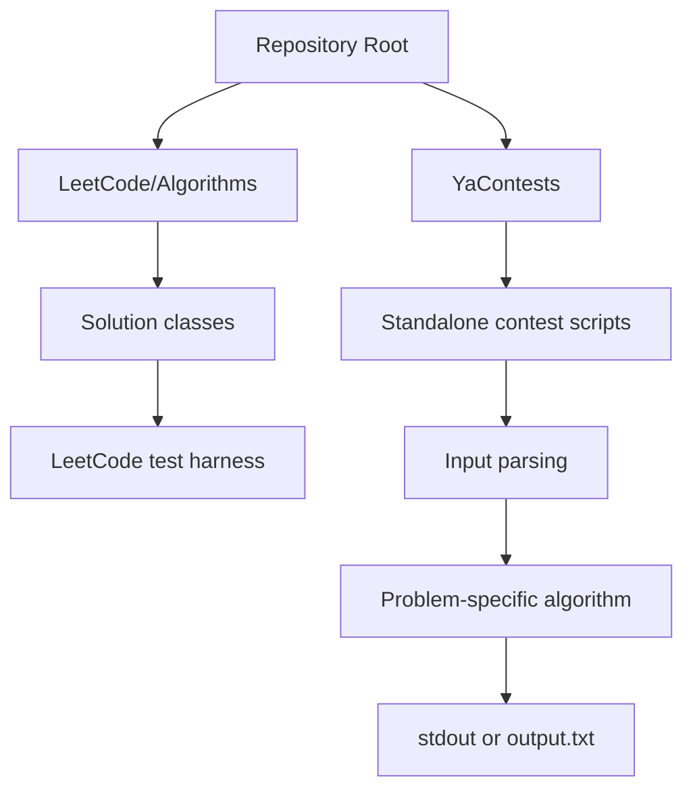
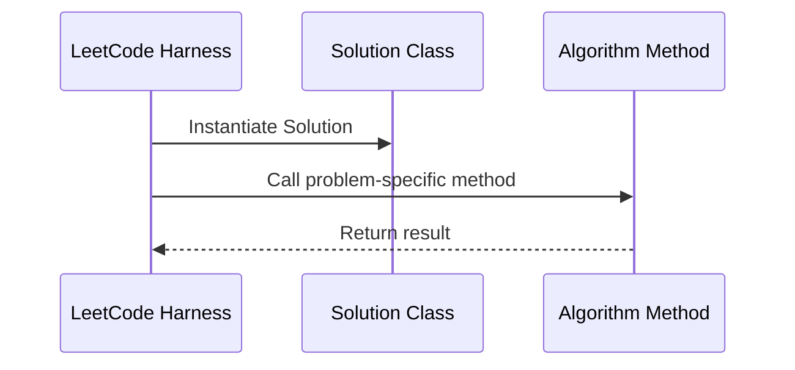
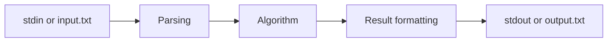

# Avilov_GIT

> A Python algorithm-practice repository focused on competitive programming, LeetCode-style interview problems, and efficient problem-specific implementations.

`Avilov_GIT` is a collection of standalone algorithmic solutions written in Python. The repository is organized around two main workflows: LeetCode-compatible class implementations and contest-style scripts for Yandex Contest / T-Bank style programming tasks.

The project is not a production web service or packaged application. Its engineering value is in the range of implemented algorithms, the use of appropriate data structures, and the ability to translate formal problem statements into concise executable solutions.

---

## Executive Summary

This repository exists as a practical archive of algorithmic problem solving. It is intended for learning, interview preparation, competitive programming practice, and demonstrating core programming fluency.

The codebase includes solutions involving:

- hash maps and set operations;
- string processing and sliding windows;
- prefix sums and counting techniques;
- dynamic programming;
- graph traversal;
- binary search;
- linked-list manipulation;
- rolling hashes;
- randomized implicit treap operations.

The repository does not currently include a database, API layer, deployment configuration, Docker setup, CI/CD pipeline, or automated test suite. It should be evaluated as an algorithm portfolio rather than as an application architecture sample.

---

## Key Engineering Highlights

- **Algorithmic Coverage**: The repository covers classic data-structure and algorithm patterns across strings, arrays, graphs, dynamic programming, and combinatorics.
- **Contest-Oriented Execution**: Most `YaContests` files are self-contained scripts with direct input parsing and output formatting.
- **LeetCode-Compatible Design**: Files under `LeetCode/Algorithms` follow the expected `Solution` class interface used by LeetCode.
- **Standard-Library-Only Implementation**: The project avoids external dependencies, which is appropriate for online judge environments.
- **Efficient Data Structures**: Several solutions use dictionaries, sets, counters, deques, prefix arrays, linked-list nodes, and randomized tree nodes.
- **Advanced Sequence Handling**: `T_Bank_6.py` implements an implicit treap with merge, split, subtree sizing, and indexed lookup.

---

## Technology Stack

| Area | Technology / Approach |
|---|---|
| Language | Python |
| Runtime Model | Standalone scripts and platform-called classes |
| External Dependencies | None detected |
| Standard Library Modules | `sys`, `collections`, `math`, `random` |
| Algorithmic Techniques | Dynamic programming, BFS, hashing, prefix sums, greedy logic, binary search |
| Data Structures | Lists, dictionaries, sets, counters, queues, linked lists, implicit treap |
| Input / Output | stdin/stdout and selected local `input.txt` / `output.txt` workflows |
| Database | Not present |
| API / Web Framework | Not present |
| Testing | No dedicated automated test suite detected |
| CI/CD | Not present |
| Deployment | Not applicable in the current repository form |

---

## System Architecture

The repository is organized as an algorithm archive rather than a layered application. Each solution file is largely independent and contains the logic needed to solve one specific problem.



### Architectural Characteristics

| Characteristic | Assessment |
|---|---|
| Coupling | Low; files are independent problem solutions |
| Reuse | Limited; helper functions are usually local to a single task |
| State Management | In-memory only |
| Runtime Model | Execute one solution file per problem |
| Configuration | No shared configuration layer |
| Extensibility | Easy to add new solutions, but metadata and tests are not standardized yet |

---

## Directory Structure

```text
Avilov_GIT/
├── README.md
├── .gitignore
├── LeetCode/
│   └── Algorithms/
│       ├── Add_Two_Numbers.py
│       ├── Distinct_Subsequences.py
│       ├── Longest_Substring_Without_Repeating_Characters.py
│       ├── Median_of_Two_Sorted_Arrays.py
│       └── Two_Sum.py
└── YaContests/
    ├── Ahaha.py
    ├── Ambulance.py
    ├── Bank_accounts.py
    ├── Bracket_shift.py
    ├── Deciphering_the_Maya_script.py
    ├── Disjoint_substring.py
    ├── T_Bank_*.py
    └── additional standalone contest solutions
```

### Directory Responsibilities

| Path | Responsibility |
|---|---|
| `LeetCode/Algorithms` | LeetCode-style solutions with platform-compatible `Solution` classes |
| `YaContests` | Standalone contest scripts for algorithmic programming problems |
| `.gitignore` | Excludes local contest input and output artifacts |
| `README.md` | Technical project documentation and repository overview |

---

## Core Components

### LeetCode Algorithms

The LeetCode section contains class-based implementations for classic interview problems.

| File | Primary Technique |
|---|---|
| `Two_Sum.py` | Hash map lookup for linear-time pair search |
| `Add_Two_Numbers.py` | Linked-list traversal with carry propagation |
| `Longest_Substring_Without_Repeating_Characters.py` | Sliding window over character positions |
| `Median_of_Two_Sorted_Arrays.py` | Binary partition search over sorted arrays |
| `Distinct_Subsequences.py` | One-dimensional dynamic programming |

These files are designed for platform execution: LeetCode instantiates the `Solution` class and invokes the required method directly.

### Contest Scripts

The `YaContests` directory contains standalone scripts for individual programming problems. Most files follow a compact contest workflow:

```text
read input
parse values
run the algorithm
print or write the result
```

Common implementation patterns include:

| Pattern | Representative Use |
|---|---|
| Set operations | Uniqueness checks, intersections, language aggregation |
| Dictionary aggregation | Account balances, sales totals, synonym lookup |
| Prefix computations | Segment sums, cumulative counts, distance scans |
| Sliding windows | Fixed-size substring and frequency matching |
| Graph traversal | Breadth-first search over adjacency lists |
| Dynamic programming | Subsequence counting and constrained counting |
| String hashing | Fast substring comparison |
| Randomized trees | Sequence mutation and indexed access |

### Implicit Treap

`YaContests/T_Bank_6.py` is the most structurally advanced module in the repository. It implements a randomized implicit treap through the `Uz` node class and related helper functions.

Key responsibilities include:

- maintaining subtree sizes;
- splitting a sequence by position;
- merging two treap fragments;
- copying nodes during structural updates;
- retrieving the k-th character;
- supporting range duplication operations efficiently.

This file demonstrates an understanding of non-trivial data structures beyond basic arrays and dictionaries.

---

## Data Model

The repository does not define a persistent domain model or database schema. All data is short-lived and stored in memory during script execution.

| Data Representation | Usage |
|---|---|
| Lists | Arrays, prefix tables, adjacency lists, dynamic-programming buffers |
| Dictionaries | Lookup tables, balances, counters, grouped values |
| Sets | Membership checks, uniqueness tracking, intersections |
| `Counter` | Frequency analysis |
| `deque` | BFS queue management |
| `ListNode` | Linked-list representation for LeetCode problems |
| `Uz` | Implicit treap node for sequence operations |

No ORM models, migrations, schema constraints, or storage abstractions are present.

---

## Application Flow

### LeetCode Flow



### Contest Script Flow



Some contest files use standard input directly. Others use hard-coded local paths such as `Avilov_GIT/YaContests/input.txt` and `Avilov_GIT/YaContests/output.txt`, which matches a local contest workflow but is less portable than stdin/stdout.

---

## Implemented Features

This repository's features are algorithmic rather than product-facing.

- LeetCode-compatible solutions for classic algorithm problems.
- Contest solutions for arithmetic, string, set, graph, and data-structure tasks.
- Local script execution through Python entry points.
- Standard input/output handling in many contest files.
- File-based input/output handling in selected contest files.
- Advanced sequence manipulation through an implicit treap.

The repository does not implement user accounts, web endpoints, database storage, authentication, authorization, background jobs, payments, deployment automation, or service monitoring.

---

## Engineering Decisions

### Self-Contained Problem Files

Each problem solution keeps its input parsing, algorithm, and output logic in one file. This is a good fit for competitive programming, where clarity of submission boundaries matters more than reusable application layering.

### Standard Library First

The repository uses only Python's standard library. This improves compatibility with online judges and avoids dependency installation friction.

### Efficient Algorithm Selection

Several files show deliberate complexity-aware implementation:

- `Median_of_Two_Sorted_Arrays.py` uses binary search instead of merging both arrays.
- `Distinct_Subsequences.py` compresses dynamic-programming state into one dimension.
- `Deciphering_the_Maya_script.py` uses fixed-size frequency arrays for sliding-window comparison.
- `T_Bank_4.py` uses BFS with pruning to find a shortest graph cycle.
- `Disjoint_substring.py` uses double rolling hashes and binary search for substring comparison.
- `T_Bank_6.py` uses an implicit treap for efficient sequence operations.

These choices are technically appropriate for time-constrained programming problems.

---

## Code Quality Assessment

### Strengths

- Most contest scripts expose a clear `main()` entry point.
- The code is concise and focused on solving specific problems.
- The repository has a low dependency surface.
- Several solutions use efficient algorithms instead of brute force.
- The directory layout separates LeetCode solutions from contest submissions.

### Limitations

- No automated tests are currently included.
- Problem metadata is not standardized: constraints, source links, sample inputs, and complexity notes are mostly absent.
- Some files use hard-coded local file paths, which reduces portability.
- Naming is inconsistent in places, including mixed transliteration and a likely typo in `T_Bamk_7.py`.
- There is no formatter, linter, type checker, or CI workflow.
- Some variable names are intentionally short in contest style, but this makes long-term maintenance harder.

---

## Scalability

Because this repository is not a long-running system, scalability is primarily algorithmic.

### What Scales Well

- Hash maps and sets provide efficient average-case lookups.
- Prefix arrays reduce repeated range computation.
- Sliding-window solutions avoid unnecessary substring recomputation.
- BFS implementations use adjacency lists and queues.
- Dynamic-programming solutions use memory compression where appropriate.
- The implicit treap supports efficient sequence mutation and indexed access.

### Potential Bottlenecks

- Repeated parsing patterns are duplicated across many files.
- Hard-coded input/output paths make automated batch execution harder.
- There is no central index of problem categories or complexities.
- Lack of tests makes future changes riskier.

---

## Security Considerations

Security risk is limited because the repository contains offline algorithm scripts rather than a networked application.

| Area | Assessment |
|---|---|
| Authentication | Not applicable |
| Authorization | Not applicable |
| Secret Management | No secrets detected |
| Input Validation | Inputs are generally assumed to match contest constraints |
| File Access | Some scripts read and write hard-coded local files |
| Network Access | Not present |
| Dependency Risk | Low, because no third-party packages are used |

For a public portfolio repository, the main improvement would be replacing hard-coded local file paths with portable stdin/stdout or configurable paths.

---

## Performance Considerations

The repository contains several performance-conscious implementations:

- dictionary lookups for linear-time search problems;
- fixed-size arrays for character frequency comparisons;
- prefix sums for range-style computations;
- BFS with pruning for graph analysis;
- reverse-order DP updates to preserve previous state;
- double modular hashing for substring comparison;
- randomized treap operations for sequence mutation.

Performance documentation would be stronger if each solution included explicit time and memory complexity notes.

---

## Testing

No dedicated test suite is currently present.

Recommended testing improvements:

| Priority | Improvement |
|---|---|
| High | Add sample input/output fixtures for contest scripts |
| High | Add `pytest` coverage for LeetCode solutions |
| Medium | Add a runner that validates all scripts against fixture directories |
| Medium | Add complexity comments for non-trivial implementations |
| Low | Add linting and formatting checks |

---

## CI/CD and Deployment

No CI/CD or deployment configuration is currently present.

That is acceptable for a local practice archive, but a portfolio-ready version would benefit from:

- GitHub Actions for syntax checks;
- automated test execution;
- optional linting with `ruff`;
- optional formatting with `black`;
- a generated problem index.

Deployment is not applicable because the repository does not contain a service, package, website, bot, or command-line application.

---

## Future Improvements

### High Priority

- Add a problem index with platform, topic, difficulty, file path, and complexity.
- Standardize input handling across contest scripts.
- Add automated tests for representative solutions.
- Keep the README aligned with the actual tracked code.

### Medium Priority

- Add problem summaries and constraints to file headers.
- Normalize file naming conventions.
- Add time and memory complexity notes.
- Introduce reusable helpers only where they reduce meaningful duplication.

### Low Priority

- Add formatter and linter configuration.
- Add CI checks.
- Add badges only after the corresponding tooling exists.

---

## Portfolio Summary

`Avilov_GIT` is a focused Python algorithm-practice repository that demonstrates steady work across classic interview and competitive-programming problems. Its strongest technical value is the breadth of implemented techniques, from hash-map lookups and sliding windows to dynamic programming, graph traversal, rolling hashes, and an implicit treap. The repository is not a production application and does not yet include infrastructure, tests, or CI, but it provides a clear foundation for demonstrating algorithmic fluency and can become a stronger engineering portfolio artifact through standardized metadata, portable execution, and automated verification.
